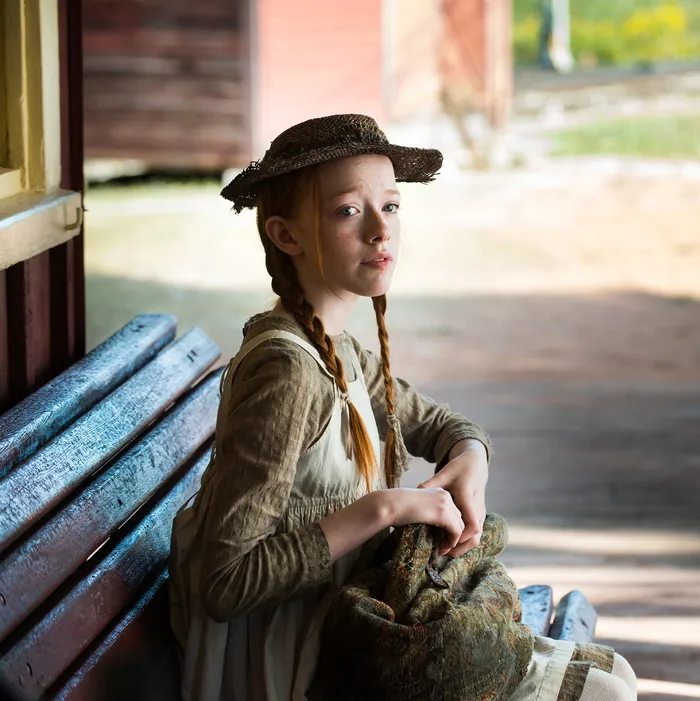
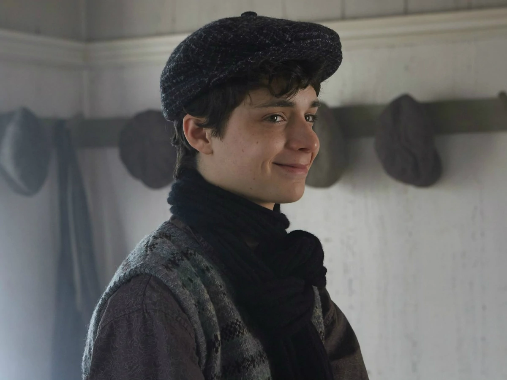

# Anne with an E

As of writing this, I only finished the first season of Anne with an E, but I'm planning to watch the rest of the show soon.

I love it! I love it soooo much! It's my absolute comfort show.

## Synopsis (spoiler-free)

"Anne with an E" is a Canadian television series that is an adaptation of the classic novel "Anne of Green Gables" by Lucy Maud Montgomery. The show follows the story of Anne Shirley, a young orphan girl who is accidentally sent to live with a brother and sister on Prince Edward Island, Canada in the late 19th century. The show explores themes of belonging, identity, and self-discovery as Anne navigates her new life and the challenges she faces. The series also deals with important social issues such as discrimination, prejudice, and gender inequality.

## Characters

**_⚠️ From here on out, there will be spoilers. ⚠️_**

### Anne Shirley

Anne Shirley is the main character of the show "Anne with an E". She is a young orphan girl who is sent to live with Matthew and Marilla Cuthbert on Prince Edward Island, Canada in the late 19th century. Anne is a unique and complex character, who is filled with positivity and sees the world through a completely different view. She is highly imaginative and has a great love for literature, poetry, and nature. She has a strong sense of self and is determined to make her own way in the world.

To me, Anne is a very relatable and comforting character. She is someone who is constantly growing and learning, and her positive outlook on life is inspiring. She teaches us to be true to ourselves, to never give up on our dreams, and to always see the best in people. She also teaches us to be compassionate and to stand up for what is right, even when it is difficult. I can relate to her a lot and she gives me a lot of comfort. Anne is a very well written character.

### Gilbert Blythe

Soon.
