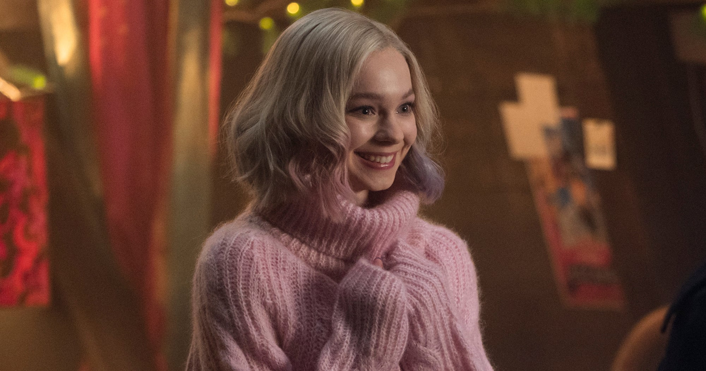

# Wednesday

I've recently watched Wednesday and I absolutely love it. It's a great show and I highly recommend it.

Also, please note, this page is highly incomplete. When I rewatch the show, I will update this page.

## Synopsis

I didn't write this yet. 😅

## Characters

**⚠️ From here on out, there will be spoilers. ⚠️**

### Wednesday

Wednesday is a very interesting character. While she looks and acts very emotionless, there are always these small moments in which we can see her emotions coming through a bit.
Personally, I can actually relate to Wednesday in many ways.

### Enid

Enid is an absolutely amazing piece of cuteness. She's an absolute comfort character. Enid is an extrovert and always positive. She just spreads positivity and good vibes everywhere.

## Episodes

Nothing here yet either
